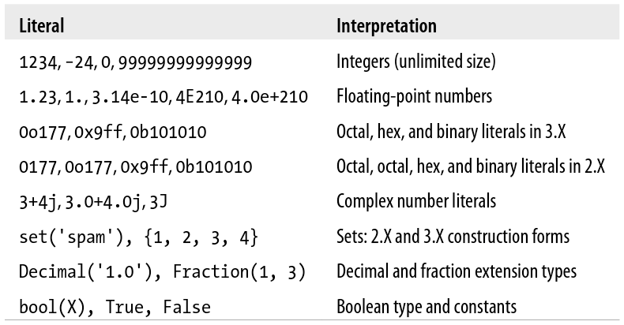
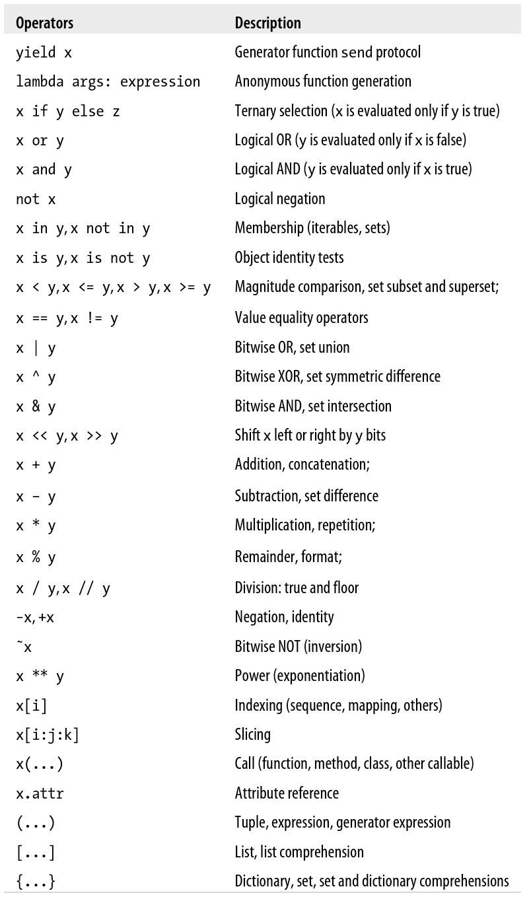
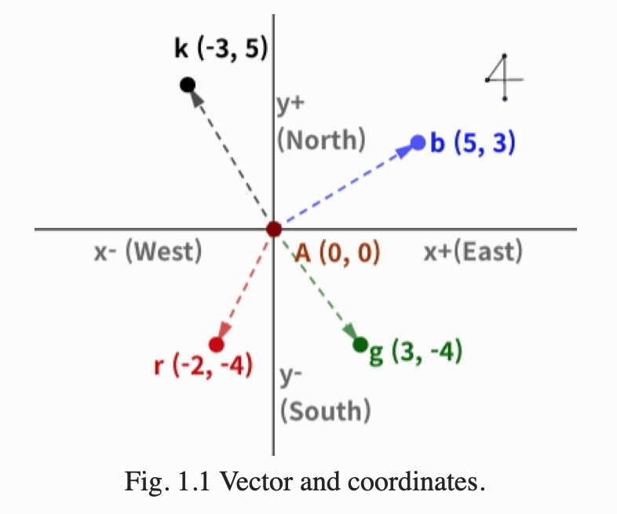

# Active Learing exercises for Python
---
**basic**

1. Factorial of a number
2. Area of a circle
6. Python Arrays 
14. Numeric types

Fig *. Numeric Types

Fig *. Operators

**linear_algebra**

1. Basic Matrix Operations
2. Vector operations
   
   **Exercise 1**

**equations**

1. Constant acceleration model

**calculus**

5. Derivatives
15. Function extremas